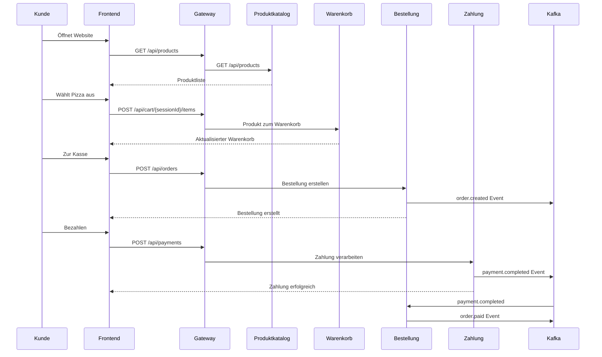

# 🍕 Restaurant Online-Bestellsystem

> Ein modulares, skalierbares Microservices-Template für Restaurant-Online-Bestellungen

---

## 📋 Inhaltsverzeichnis

1. [Projektübersicht](#projektübersicht)
2. [Schnellstart](#schnellstart)
3. [Aufgabenstellung](#aufgabenstellung)
4. [Projekt-Plan](#projekt-plan)
5. [Architektur](#architektur)
6. [Microservices](#microservices)
7. [Technologie-Stack](#technologie-stack)
8. [API-Dokumentation](#api-dokumentation)
9. [Installation & Setup](#installation--setup)
10. [Workflow & Bestellprozess](#workflow--bestellprozess)
11. [Reflexion & Entscheidungen](#reflexion--entscheidungen)

### 📚 Weitere Dokumentation

- **[PROJECT_PLAN.md](./docs/PROJECT_PLAN.md)** – Detaillierter Projektplan mit Must-Haves
- **[DOCUMENTATION.md](./docs/DOCUMENTATION.md)** – Entwicklungs-Tagebuch & Entscheidungen

---

## 📁 Projektstruktur

```
restaurant-application/
├── README.md                 # Diese Datei
├── backend/                  # Spring Boot Backend Server
├── website/                  # React Kunden-Portal
├── client/                   # Electron Restaurant KDS App
└── docs/                     # Dokumentation
    ├── PROJECT_PLAN.md       # Projektplan & Must-Haves
    ├── DOCUMENTATION.md      # Entwicklungs-Tagebuch
    └── *.pdf                 # Aufgabenstellung
```

---

## 📖 Projektübersicht

Dieses Projekt ist ein **generisches Template** für ein Restaurant-Online-Bestellsystem. Es basiert auf einer **Microservices-Architektur** und demonstriert moderne Softwareentwicklungspraktiken wie:

- Service Discovery mit Eureka
- API Gateway für zentrales Routing
- Asynchrone Kommunikation mit Kafka
- Circuit Breaker Pattern für Fehlertoleranz
- Containerisierung mit Docker

Das System ermöglicht Kunden, online Speisen zu durchsuchen, in den Warenkorb zu legen und zu bestellen – ähnlich bekannter Pizzeria-Bestellsysteme, jedoch als anpassbares Template ohne spezifische Markenidentität.

---

## 🎯 Aufgabenstellung

### Ziel

Entwicklung einer **Shop-Anwendung mit Microservices-Architektur** für ein Restaurant/Pizzeria-Bestellsystem. Die Anwendung soll die wichtigsten Aspekte einer Business-Anwendung demonstrieren und dabei verschiedene Services und Tools einer Microservices-Architektur einsetzen.

### Anforderungen

| Nr. | Anforderung                                                                | Status |
| --- | -------------------------------------------------------------------------- | ------ |
| 1   | Jeder Service besitzt bei Bedarf eigene Datenbank (Service-Unabhängigkeit) | ⬜     |
| 2   | Docker für Datenbank-Container                                             | ⬜     |
| 3   | REST APIs für Service-Kommunikation (Spring REST Controllers)              | ⬜     |
| 4   | Sicherheitsaspekte bei sensiblen Daten berücksichtigen                     | ⬜     |
| 5   | Fehlerbehandlungsmechanismen (Circuit Breaker)                             | ⬜     |
| 6   | Dokumentierte Services mit klaren Aufgaben                                 | ⬜     |
| 7   | Grafische Architekturskizze mit Überlegungen                               | ⬜     |
| 8   | Clean Code Regeln                                                          | ⬜     |
| 9   | API-Dokumentation mit Swagger/OpenAPI                                      | ⬜     |

### Hauptkomponenten

Die Anwendung besteht aus:

- **Frontend**: React-basierte Single Page Application
- **Warenkorb-Microservice**: Verwaltung der Kundenwarenkörbe
- **3-4 weitere Microservices**: Produktkatalog, Bestellung, Zahlung, etc.
- **Infrastruktur-Services**: Gateway, Service Discovery, Message Broker

### Bestellprozess-Beispiel

```
┌─────────────┐     ┌──────────────┐     ┌─────────────────┐     ┌──────────────┐
│   Frontend  │ ──▶ │  Produktkata-│ ──▶ │   Warenkorb-    │ ──▶ │  Bestell-    │
│   (React)   │     │  log-Service │     │   Service       │     │  Service     │
└─────────────┘     └──────────────┘     └─────────────────┘     └──────────────┘
                                                                        │
                                                                        ▼
                                                                 ┌──────────────┐
                                                                 │  Zahlungs-   │
                                                                 │  Service     │
                                                                 └──────────────┘
```

---

## 🏗️ Architektur

### Architekturdiagramm

```
                                    ┌─────────────────────────────────────────────────────────────┐
                                    │                        DOCKER NETWORK                        │
                                    │                                                             │
┌──────────────┐                    │  ┌─────────────────────────────────────────────────────┐   │
│              │                    │  │                    API GATEWAY                       │   │
│   Browser/   │  HTTP Requests     │  │                  (Spring Cloud Gateway)              │   │
│   Client     │ ──────────────────▶│  │                    Port: 8080                        │   │
│              │                    │  └─────────────────────────────────────────────────────┘   │
└──────────────┘                    │                           │                                │
                                    │                           │ Load Balancing                 │
                                    │                           ▼                                │
                                    │  ┌─────────────────────────────────────────────────────┐   │
                                    │  │              EUREKA SERVICE DISCOVERY               │   │
                                    │  │                    Port: 8761                        │   │
                                    │  └─────────────────────────────────────────────────────┘   │
                                    │                           │                                │
                                    │          ┌────────────────┼────────────────┐              │
                                    │          │                │                │              │
                                    │          ▼                ▼                ▼              │
                                    │  ┌──────────────┐ ┌──────────────┐ ┌──────────────┐      │
                                    │  │  Produkt-    │ │  Warenkorb-  │ │  Bestell-    │      │
                                    │  │  Katalog     │ │  Service     │ │  Service     │      │
                                    │  │  :8081       │ │  :8082       │ │  :8083       │      │
                                    │  └──────┬───────┘ └──────┬───────┘ └──────┬───────┘      │
                                    │         │                │                │              │
                                    │         ▼                ▼                ▼              │
                                    │  ┌──────────────┐ ┌──────────────┐ ┌──────────────┐      │
                                    │  │  PostgreSQL  │ │    Redis     │ │  PostgreSQL  │      │
                                    │  │    :5432     │ │    :6379     │ │    :5433     │      │
                                    │  └──────────────┘ └──────────────┘ └──────────────┘      │
                                    │                                                          │
                                    │  ┌─────────────────────────────────────────────────────┐ │
                                    │  │                  APACHE KAFKA                        │ │
                                    │  │          (Asynchrone Kommunikation)                  │ │
                                    │  │                    :9092                             │ │
                                    │  └─────────────────────────────────────────────────────┘ │
                                    │                                                          │
                                    └──────────────────────────────────────────────────────────┘
```

### Architektur-Entscheidungen

| Komponente            | Entscheidung         | Begründung                                                  |
| --------------------- | -------------------- | ----------------------------------------------------------- |
| **API Gateway**       | Spring Cloud Gateway | Zentraler Einstiegspunkt, Load Balancing, Authentifizierung |
| **Service Discovery** | Netflix Eureka       | Dynamische Service-Registrierung, Health Checks             |
| **Message Broker**    | Apache Kafka         | Entkopplung der Services, Event-Driven Architecture         |
| **Circuit Breaker**   | Resilience4j         | Fehlertoleranz, Fallback-Mechanismen                        |
| **Datenbanken**       | PostgreSQL + Redis   | SQL für Persistenz, Redis für schnellen Cache (Warenkorb)   |

---

## 🔧 Microservices

### 1. Produktkatalog-Service (product-catalog-service)

**Zweck**: Verwaltung aller Produkte (Pizzen, Getränke, etc.) mit Namen, Beschreibungen, Preisen und Verfügbarkeit.

**Technologien**:

- Spring Boot 3.x
- Spring Data JPA
- PostgreSQL Datenbank
- Swagger/OpenAPI

**Datenbank-Argumentation**: ✅ **Eigene Datenbank** – Der Produktkatalog ist ein Kernservice mit eigenständigem Datenmodell. Änderungen an Produkten dürfen keine anderen Services beeinflussen.

**Endpoints**:
| Methode | Endpoint | Beschreibung |
|---------|----------|--------------|
| GET | `/api/products` | Alle Produkte abrufen |
| GET | `/api/products/{id}` | Einzelnes Produkt abrufen |
| GET | `/api/products/category/{category}` | Produkte nach Kategorie |
| POST | `/api/products` | Neues Produkt hinzufügen |
| PUT | `/api/products/{id}` | Produkt aktualisieren |
| DELETE | `/api/products/{id}` | Produkt löschen |

**Datenmodell**:

```java
Product {
    Long id;
    String name;
    String description;
    BigDecimal price;
    String category;        // PIZZA, DRINK, DESSERT, SIDE
    String imageUrl;
    boolean available;
    List<String> allergens;
    Map<String, BigDecimal> sizes;  // S, M, L mit Preisunterschieden
}
```

---

### 2. Warenkorb-Service (cart-service)

**Zweck**: Ermöglicht Kunden das Hinzufügen, Entfernen und Verwalten von Produkten im virtuellen Warenkorb.

**Technologien**:

- Spring Boot 3.x
- Spring Data Redis
- Redis (NoSQL für schnelle Datenzugriffe)

**Datenbank-Argumentation**: ✅ **Eigene Datenbank (Redis)** – Warenkörbe sind temporäre, session-basierte Daten. Redis bietet schnelle Lese-/Schreibzugriffe und automatische TTL (Time-to-Live) für abgelaufene Warenkörbe.

**Endpoints**:
| Methode | Endpoint | Beschreibung |
|---------|----------|--------------|
| GET | `/api/cart/{sessionId}` | Warenkorb abrufen |
| POST | `/api/cart/{sessionId}/items` | Produkt hinzufügen |
| PUT | `/api/cart/{sessionId}/items/{itemId}` | Menge aktualisieren |
| DELETE | `/api/cart/{sessionId}/items/{itemId}` | Produkt entfernen |
| DELETE | `/api/cart/{sessionId}` | Warenkorb leeren |

**Datenmodell**:

```java
Cart {
    String sessionId;
    List<CartItem> items;
    BigDecimal totalPrice;
    LocalDateTime createdAt;
    LocalDateTime expiresAt;
}

CartItem {
    Long productId;
    String productName;
    int quantity;
    String size;
    BigDecimal unitPrice;
    BigDecimal totalPrice;
    List<String> extras;
}
```

---

### 3. Bestell-Service (order-service)

**Zweck**: Verarbeitet Bestellungen von Kunden, inklusive Bestelldetails, Status-Tracking und Zahlungsinformationen.

**Technologien**:

- Spring Boot 3.x
- Spring Data JPA
- PostgreSQL Datenbank
- Apache Kafka (Events publizieren)

**Datenbank-Argumentation**: ✅ **Eigene Datenbank** – Bestellungen sind kritische Geschäftsdaten mit eigenem Lebenszyklus (Status-Übergänge). Transaktionssicherheit ist essentiell.

**Endpoints**:
| Methode | Endpoint | Beschreibung |
|---------|----------|--------------|
| POST | `/api/orders` | Neue Bestellung erstellen |
| GET | `/api/orders/{id}` | Bestellung abrufen |
| GET | `/api/orders/customer/{customerId}` | Bestellhistorie |
| PUT | `/api/orders/{id}/status` | Status aktualisieren |
| GET | `/api/orders/{id}/track` | Lieferstatus tracken |

**Kafka Events**:

- `order.created` – Neue Bestellung wurde erstellt
- `order.paid` – Zahlung erfolgreich
- `order.preparing` – Zubereitung gestartet
- `order.ready` – Bestellung fertig
- `order.delivered` – Bestellung geliefert

**Datenmodell**:

```java
Order {
    Long id;
    String customerId;
    List<OrderItem> items;
    OrderStatus status;     // CREATED, PAID, PREPARING, READY, DELIVERED, CANCELLED
    BigDecimal totalAmount;
    DeliveryInfo deliveryInfo;
    PaymentInfo paymentInfo;
    LocalDateTime orderTime;
    LocalDateTime estimatedDelivery;
}
```

---

### 4. Zahlungs-Service (payment-service) – Mockup

**Zweck**: Verarbeitet Zahlungsvorgänge (Mockup für Demonstrationszwecke).

**Technologien**:

- Spring Boot 3.x
- In-Memory Speicher (H2 für Mockup)

**Datenbank-Argumentation**: ⚠️ **Mockup ohne persistente Datenbank** – Für Demonstrationszwecke werden Zahlungen simuliert. In einer Produktionsumgebung würde hier eine Integration mit echten Zahlungsdienstleistern (Stripe, PayPal) erfolgen.

**Endpoints**:
| Methode | Endpoint | Beschreibung |
|---------|----------|--------------|
| POST | `/api/payments` | Zahlung durchführen |
| GET | `/api/payments/{id}` | Zahlungsstatus abrufen |
| POST | `/api/payments/{id}/refund` | Rückerstattung initiieren |

**Unterstützte Zahlungsmethoden** (Mockup):

- Kreditkarte
- PayPal
- Barzahlung bei Lieferung

---

## 💻 Technologie-Stack

### Backend

| Technologie          | Version | Verwendung                  |
| -------------------- | ------- | --------------------------- |
| Java                 | 21 LTS  | Programmiersprache          |
| Spring Boot          | 3.2.x   | Framework                   |
| Spring Cloud         | 2023.x  | Microservices-Infrastruktur |
| Spring Cloud Gateway | -       | API Gateway                 |
| Netflix Eureka       | -       | Service Discovery           |
| Resilience4j         | -       | Circuit Breaker             |
| Apache Kafka         | 3.x     | Message Broker              |

### Datenbanken

| Datenbank  | Verwendung                   |
| ---------- | ---------------------------- |
| PostgreSQL | Produktkatalog, Bestellungen |
| Redis      | Warenkorb (Cache)            |
| H2         | Mockup-Services (In-Memory)  |

### Frontend

| Technologie  | Verwendung  |
| ------------ | ----------- | ------------ |
| React        | 18.x        | UI Framework |
| TypeScript   | Type Safety |
| Tailwind CSS | Styling     |
| Axios        | HTTP Client |

### DevOps & Infrastruktur

| Technologie     | Verwendung                     |
| --------------- | ------------------------------ |
| Docker          | Containerisierung              |
| Docker Compose  | Multi-Container Orchestrierung |
| Swagger/OpenAPI | API Dokumentation              |

---

## 📚 API-Dokumentation

Die API-Dokumentation ist über Swagger UI verfügbar:

- **Gateway**: `http://localhost:8080/swagger-ui.html`
- **Produktkatalog**: `http://localhost:8081/swagger-ui.html`
- **Warenkorb**: `http://localhost:8082/swagger-ui.html`
- **Bestellung**: `http://localhost:8083/swagger-ui.html`
- **Zahlung**: `http://localhost:8084/swagger-ui.html`

---

## 🚀 Installation & Setup

### Voraussetzungen

- Java 21+
- Docker & Docker Compose
- Node.js 18+ (für Frontend)
- Maven 3.9+

### Quick Start

```bash
# Repository klonen
git clone https://github.com/[username]/restaurant-application.git
cd restaurant-application

# Infrastruktur starten (Datenbanken, Kafka, etc.)
docker-compose up -d

# Services starten (in separaten Terminals oder mit Script)
./start-services.sh

# Frontend starten
cd frontend
npm install
npm run dev
```

### Docker Compose

```yaml
# docker-compose.yml Struktur
services:
  postgres-products:
    image: postgres:15
    ports: ["5432:5432"]

  postgres-orders:
    image: postgres:15
    ports: ["5433:5432"]

  redis:
    image: redis:7
    ports: ["6379:6379"]

  zookeeper:
    image: confluentinc/cp-zookeeper:7.4.0

  kafka:
    image: confluentinc/cp-kafka:7.4.0
    ports: ["9092:9092"]

  eureka-server:
    build: ./eureka-server
    ports: ["8761:8761"]

  api-gateway:
    build: ./api-gateway
    ports: ["8080:8080"]
```

---

## 🔄 Workflow & Bestellprozess

### Kunde bestellt eine Pizza



---

## 📝 Reflexion & Entscheidungen

### Woche 1 (04.12.2025)

- **Projektdefinition**: Restaurant-Online-Bestellsystem als Microservices-Template
- **Architektur-Entscheidungen**:
  - Gateway + Eureka als Basis
  - 4 Kern-Services identifiziert
  - Kafka für asynchrone Kommunikation

### Architektur-Überlegungen

**Warum Microservices?**

- Unabhängige Skalierung (z.B. mehr Bestell-Service Instanzen bei hoher Last)
- Technologie-Flexibilität (Redis für Warenkorb, PostgreSQL für Bestellungen)
- Fehlertoleranz durch Isolation

**Warum diese Datenbank-Aufteilung?**
| Service | Datenbank | Grund |
|---------|-----------|-------|
| Produktkatalog | PostgreSQL | Strukturierte Produktdaten, komplexe Abfragen |
| Warenkorb | Redis | Temporäre Daten, schnelle Zugriffe, TTL |
| Bestellung | PostgreSQL | Transaktionssicherheit, Audit-Trail |
| Zahlung | Mockup/H2 | Demo-Zwecke, externe API in Produktion |

---

## 👥 Autoren

- [Name 1]
- [Name 2]

---

## 📄 Lizenz

Dieses Projekt ist als Template für Bildungszwecke konzipiert.

---

_Letzte Aktualisierung: 04.12.2025_
